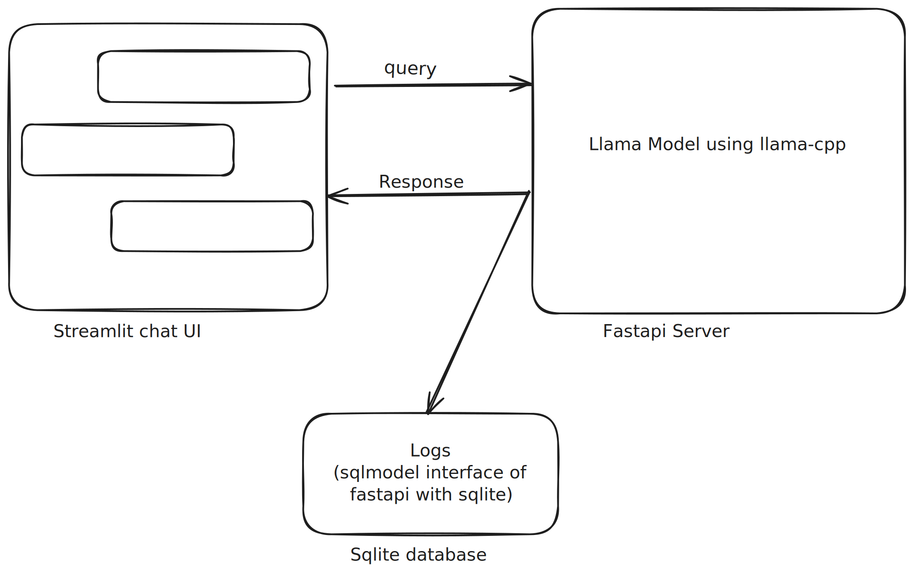

# llama_chatbot
A chatbot interace that leverages llama2 model in the backend

- Backend: Fastapi to expose Llama model using llama-cpp-python
- Frontend: STreamlit chat interface to ask questions
- Storage: Use sqlite to store all chat logs

## App Architecture

